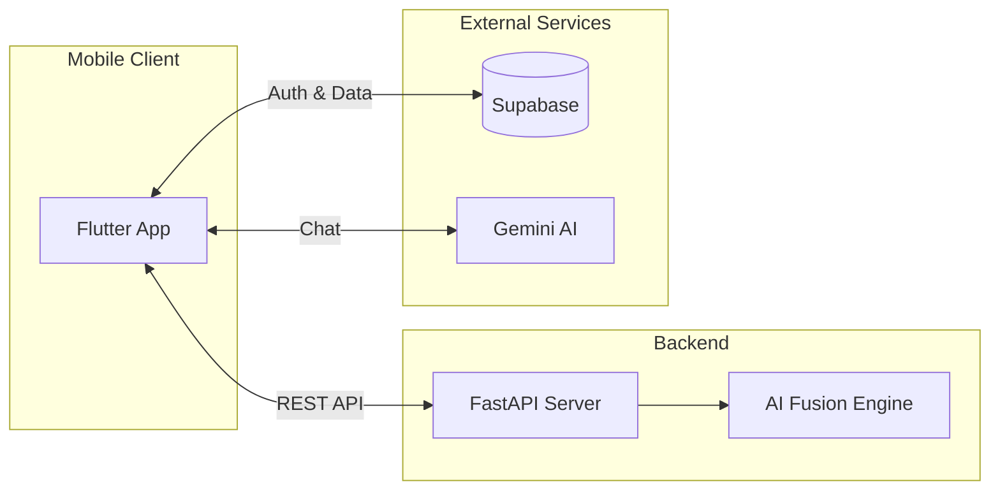
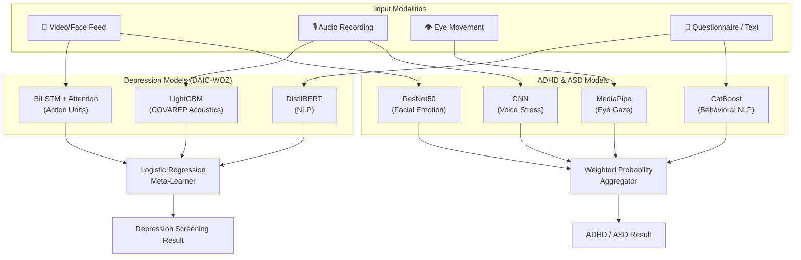
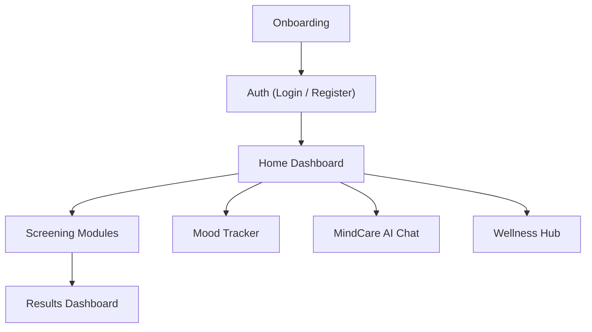

<p align="center">
  
</p>

<h1 align="center">Mindful</h1>
<p align="center"><strong>AI-Powered Multimodal Mental Health Screening & Companion</strong></p>

<p align="center">
  <a href="https://flutter.dev"></a>
  <a href="https://fastapi.tiangolo.com"></a>
  <a href="https://www.python.org"></a>
  <a href="https://www.tensorflow.org"></a>
  <a href="https://supabase.com"></a>
  <a href="LICENSE"></a>
</p>

<p align="center">
  <em>A multimodal AI system for early screening of <strong>ADHD</strong>, <strong>Autism (ASD)</strong>, <strong>Depression</strong>, and <strong>Social Anxiety</strong> — combining Computer Vision, Voice Analysis, NLP, and an empathetic AI companion.</em>
</p>

---

## ✨ Key Features

| Feature | Description |
|:---|:---|
| 🧬 **Multimodal Screening** | Fuses behavioral questionnaires, eye-gaze heuristics, facial emotion recognition, and voice prosody for objective detection |
| 🤖 **MindCare AI Companion** | Empathetic chatbot powered by Gemini 2.5 Flash for mental health support and emotional navigation |
| 🧘 **Wellness & Meditation Hub** | Clinically-informed meditations (MBSR/MBCT) with in-app audio streaming |
| 📊 **Mood Monitoring** | Daily mood logging with trend analysis and weekly overviews |
| 🎙️ **Voice Stress Analysis** | MFCC-based emotion and impulsivity detection from audio recordings |
| 👁️ **Gaze & Facial Tracking** | MediaPipe-powered eye movement analysis and facial emotion recognition |
| 🌓 **Adaptive Theming** | Premium dark/light mode with glassmorphism design |
| ⚡ **Async Job Processing** | Non-blocking screening — submit and get notified when results are ready |

---

## 🏗️ Architecture

### System Overview



### AI Fusion Pipeline

Mindful employs a **late-fusion strategy** combining signals from multiple behavioral domains:



### App Screen Flow



---

## 🛠️ Tech Stack

| Layer | Technologies |
|:---|:---|
| **Frontend** | Flutter 3.7+, Provider, Supabase Auth, Camera, `just_audio`, `flutter_animate`, `flutter_dotenv` |
| **Backend** | FastAPI (async), Uvicorn, BackgroundTasks, Pydantic |
| **AI / ML** | TensorFlow, PyTorch, Scikit-learn, CatBoost, XGBoost, LightGBM, MediaPipe, Librosa, OpenCV |
| **NLP** | Gemini 2.5 Flash (Companion), DistilBERT (Depression), Transformers |
| **Database** | Supabase (Auth, User Data & Results) |

---

## 📁 Project Structure

```
AI-mental-Health/
├── backend/
│   ├── main.py                    # FastAPI entry point & all endpoints
│   ├── requirements.txt           # Python dependencies
│   ├── config/
│   │   └── model_config.py        # Model paths & inference thresholds
│   ├── services/
│   │   ├── model_router.py        # Routes inputs to correct ML models
│   │   ├── model_loader.py        # Lazy-loads model weights
│   │   ├── feature_extractor.py   # Audio/video/face feature extraction
│   │   ├── adhd_fusion.py         # ADHD multimodal fusion logic
│   │   └── depression_fusion.py   # Depression fusion (DAIC-WOZ)
│   ├── Models/                    # ⚠️ Downloaded separately (gitignored)
│   │   ├── adhd/                  # ADHD .pkl, .keras model weights
│   │   ├── asd/                   # ASD .joblib and face models
│   │   └── depression/            # DAIC-WOZ .pt, .joblib, text_model_dir
│   └── .env.example               # Backend environment template
├── frontend/
│   ├── lib/
│   │   ├── main.dart              # App entry point & Supabase init
│   │   ├── core/config/           # API config (env-driven URLs)
│   │   ├── screens/               # All app screens
│   │   ├── services/              # Gemini, jobs, storage, model services
│   │   ├── widgets/               # Reusable UI components
│   │   └── theme/                 # App colors & theming
│   ├── pubspec.yaml               # Flutter dependencies
│   ├── .env                       # ⚠️ YOU CREATE THIS (gitignored)
│   └── assets/                    # Images, fonts, SVGs
├── .env.example                   # Root environment template
├── .gitignore                     # Comprehensive gitignore rules
├── LICENSE                        # MIT License
└── README.md                      # ← You are here
```

---

## 🚀 Getting Started

### Prerequisites

| Tool | Version | Link |
|:---|:---|:---|
| **Python** | 3.10 – 3.12 | [python.org](https://www.python.org/downloads/) |
| **Flutter** | ≥ 3.7.0 | [flutter.dev](https://docs.flutter.dev/get-started/install) |
| **Git** | Any recent | [git-scm.com](https://git-scm.com/downloads) |
| **FFmpeg** | Any *(optional, for audio extraction)* | [ffmpeg.org](https://ffmpeg.org/download.html) |

### 1. Clone the Repository

```bash
git clone https://github.com/A7med580/AI-mental-Health.git
cd AI-mental-Health
```

### 2. Environment Variables

All secrets are loaded from `.env` files that are **gitignored** — you must create them manually.

#### Frontend `.env` (required)

```bash
cp .env.example frontend/.env
```

Edit `frontend/.env` with your credentials:

```env
SUPABASE_URL=https://your-project-ref.supabase.co
SUPABASE_ANON_KEY=your-supabase-anon-key
GEMINI_API_KEY=your-gemini-api-key
BACKEND_HOST=your-local-ip
```

> [!WARNING]
> Without `frontend/.env`, the Flutter app will fail to build with: `No file or variants found for asset: .env`

#### Get Your API Keys

| Key | Where to Get It |
|:---|:---|
| **Supabase URL & Anon Key** | [Supabase Dashboard](https://supabase.com/dashboard) → Project Settings → API |
| **Gemini API Key** | [Google AI Studio](https://aistudio.google.com/apikey) |

### 3. Download AI Models

Pre-trained model weights are too large for Git. Download them separately:

1. **Download**: [📦 Mindful AI Models (Google Drive)](https://drive.google.com/drive/folders/1DlIcp-XBuJwFHGiEiisUnSHuxXqU59ZW?usp=sharing)
2. **Place** the folders into `backend/Models/`:

```
backend/Models/
├── adhd/          # ADHD .pkl and .keras files
├── asd/           # ASD .joblib and face/ models
└── depression/    # DAIC-WOZ .pt, .joblib and text_model_dir
```

> [!TIP]
> The backend has **robust fallback loading** — if a model file is missing, the server will log a warning and continue with available models rather than crashing.

### 4. Backend Setup

```bash
# Navigate to backend
cd backend

# Create virtual environment
python3 -m venv .venv
source .venv/bin/activate          # macOS/Linux
# .\.venv\Scripts\Activate         # Windows PowerShell

# Install dependencies
pip install -r requirements.txt

# Start the server
uvicorn main:app --host 0.0.0.0 --port 8000
```

Verify it's running: open [http://localhost:8000/health](http://localhost:8000/health) — you should see `{"status": "healthy"}`.

**Swagger UI**: [http://localhost:8000/docs](http://localhost:8000/docs)

### 5. Frontend Setup

```bash
# Navigate to frontend
cd frontend

# Install Flutter dependencies
flutter pub get

# Run the app
flutter run
```

---

## 🔌 Connecting Frontend ↔ Backend

The app auto-detects the correct backend URL based on the platform:

| Platform | URL | Notes |
|:---|:---|:---|
| Android Emulator | `http://10.0.2.2:8000` | Automatic |
| iOS Simulator | `http://127.0.0.1:8000` | Automatic |
| Web | `http://localhost:8000` | Automatic |
| Physical Device | `http://<YOUR_IP>:8000` | Set `BACKEND_HOST` in `frontend/.env` |

**For physical devices**, find your LAN IP and set it in `frontend/.env`:

```bash
# macOS
ipconfig getifaddr en0

# Windows
ipconfig    # Look for IPv4 Address
```

> [!IMPORTANT]
> Both your phone and computer must be on the **same Wi-Fi network**.

---

## 📡 API Endpoints

| Method | Endpoint | Description |
|:---|:---|:---|
| `GET` | `/health` | Health check |
| `POST` | `/screening/adhd` | Synchronous ADHD screening |
| `POST` | `/jobs/adhd` | Async ADHD job (returns `job_id`) |
| `POST` | `/jobs/depression` | Async Depression job |
| `GET` | `/jobs/{job_id}` | Check job status |
| `GET` | `/jobs/{job_id}/result` | Get completed job result |
| `POST` | `/asd/text/predict` | ASD text-based prediction (AQ-10) |
| `POST` | `/asd/face/predict-url` | ASD face prediction from image URL |
| `POST` | `/predict/adhd/eye` | ADHD eye-gaze analysis |
| `POST` | `/predict/adhd/facial` | ADHD facial emotion analysis |
| `POST` | `/extract-features` | Extract features from any modality |
| `POST` | `/run-screening` | General multi-condition screening |

Full interactive docs available at `/docs` (Swagger UI) when the server is running.

---

## 🧪 Quick Start (TL;DR)

```bash
# Terminal 1 — Backend
cd backend
source .venv/bin/activate
uvicorn main:app --host 0.0.0.0 --port 8000

# Terminal 2 — Frontend
cd frontend
flutter run
```

---

## ⚠️ Troubleshooting

| Issue | Solution |
|:---|:---|
| `No file or variants found for asset: .env` | Create `frontend/.env` with Supabase + Gemini credentials |
| `ModuleNotFoundError: No module named 'mediapipe'` | Run `pip install mediapipe` inside the activated venv |
| `pandas==2.0.3` build fails on Python 3.12+ | Run `pip install pandas>=2.1.0` first |
| App can't reach backend on physical device | Set `BACKEND_HOST` in `frontend/.env` to your LAN IP |
| `gradle assembleDebug` fails | Run `cd frontend/android && ./gradlew clean` |
| Emulator not detected | Run `flutter emulators --launch <id>`, wait, then retry |

> [!NOTE]
> **macOS External Drive Users**: Standard ExFAT drives do not support symlinks required by Flutter/Dart. Use an **APFS Sparse Disk Image** or an APFS-formatted drive.

---

## 📜 License

This project is open-source under the [MIT License](LICENSE).

---

## ⚕️ Disclaimer

> [!CAUTION]
> **Mindful is an academic research prototype.** It is designed for study and exploration of multimodal objective biomarkers. It is **not** a certified medical diagnostic tool and should **not** be used as a substitute for professional medical advice, diagnosis, or treatment.

---

## 📄 Citation

If you use this codebase in your research, please cite:

```bibtex
@software{Mindful_AI_Mental_Health,
  author    = {Ali, Mohamed},
  title     = {Mindful: Multimodal AI Mental Health Screening \& Companion},
  year      = {2024},
  url       = {https://github.com/A7med580/AI-mental-Health}
}
```

---

<p align="center">
  Built with ❤️ for mental health awareness
</p>
