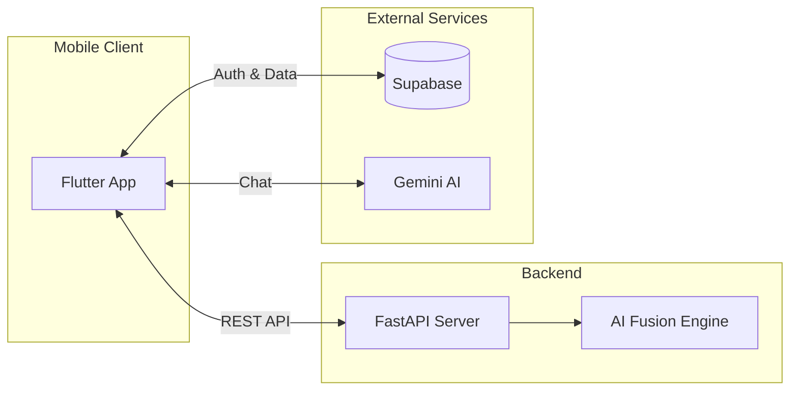
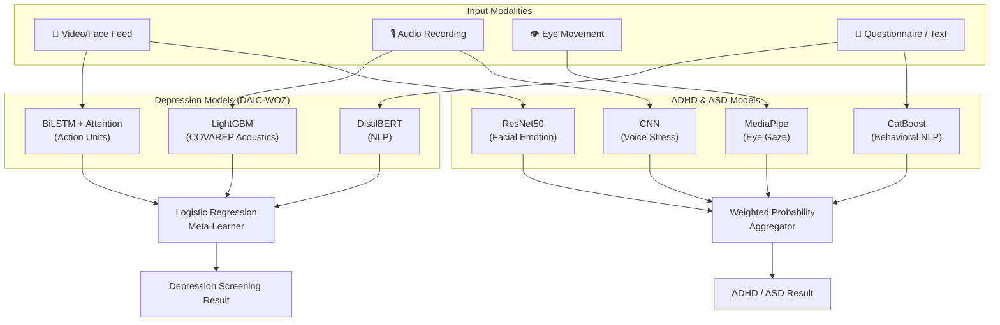
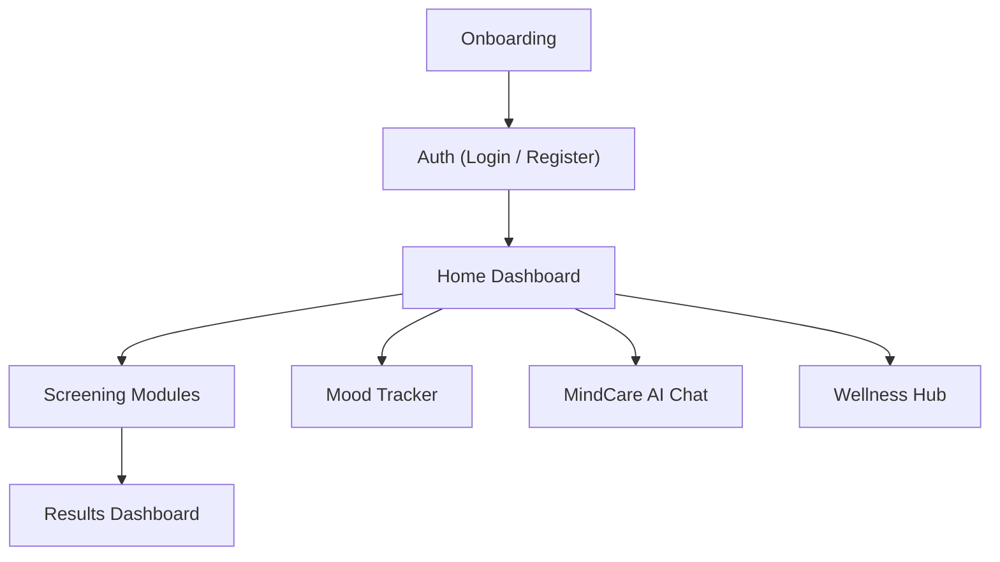

<p align="center">
  
</p>

<h1 align="center">Mindful</h1>
<p align="center"><strong>AI-Powered Multimodal Mental Health Screening & Companion</strong></p>

<p align="center">
  <a href="https://flutter.dev"></a>
  <a href="https://fastapi.tiangolo.com"></a>
  <a href="https://www.python.org"></a>
  <a href="https://www.tensorflow.org"></a>
  <a href="https://supabase.com"></a>
  <a href="LICENSE"></a>
</p>

<p align="center">
  <em>A multimodal AI system for early screening of <strong>ADHD</strong>, <strong>Autism (ASD)</strong>, <strong>Depression</strong>, and <strong>Social Anxiety</strong> — combining Computer Vision, Voice Analysis, NLP, and an empathetic AI companion.</em>
</p>

---

## ✨ Key Features

| Feature | Description |
|:---|:---|
| 🧬 **Multimodal Screening** | Fuses behavioral questionnaires, eye-gaze heuristics, facial emotion recognition, and voice prosody for objective detection |
| 🤖 **MindCare AI Companion** | Empathetic chatbot powered by Gemini 2.5 Flash for mental health support and emotional navigation |
| 🧘 **Wellness & Meditation Hub** | Clinically-informed meditations (MBSR/MBCT) with in-app audio streaming |
| 📊 **Mood Monitoring** | Daily mood logging with trend analysis and weekly overviews |
| 🎙️ **Voice Stress Analysis** | MFCC-based emotion and impulsivity detection from audio recordings |
| 👁️ **Gaze & Facial Tracking** | MediaPipe-powered eye movement analysis and facial emotion recognition |
| 🌓 **Adaptive Theming** | Premium dark/light mode with glassmorphism design |
| ⚡ **Async Job Processing** | Non-blocking screening — submit and get notified when results are ready |

---

## 🏗️ Architecture

### System Overview



### AI Fusion Pipeline

Mindful employs a **late-fusion strategy** combining signals from multiple behavioral domains:



### App Screen Flow



---

## 🛠️ Tech Stack

| Layer | Technologies |
|:---|:---|
| **Frontend** | Flutter 3.7+, Provider, Supabase Auth, Camera, `just_audio`, `flutter_animate`, `flutter_dotenv` |
| **Backend** | FastAPI (async), Uvicorn, BackgroundTasks, Pydantic |
| **AI / ML** | TensorFlow, PyTorch, Scikit-learn, CatBoost, XGBoost, LightGBM, MediaPipe, Librosa, OpenCV |
| **NLP** | Gemini 2.5 Flash (Companion), DistilBERT (Depression), Transformers |
| **Database** | Supabase (Auth, User Data & Results) |

---

## 📁 Project Structure

```
AI-mental-Health/
├── backend/
│   ├── main.py                    # FastAPI entry point & all endpoints
│   ├── requirements.txt           # Python dependencies
│   ├── config/
│   │   └── model_config.py        # Model paths & inference thresholds
│   ├── services/
│   │   ├── model_router.py        # Routes inputs to correct ML models
│   │   ├── model_loader.py        # Lazy-loads model weights
│   │   ├── feature_extractor.py   # Audio/video/face feature extraction
│   │   ├── adhd_fusion.py         # ADHD multimodal fusion logic
│   │   └── depression_fusion.py   # Depression fusion (DAIC-WOZ)
│   ├── Models/                    # ⚠️ Downloaded separately (gitignored)
│   │   ├── ADHD/                  # ADHD .pkl, .keras model weights
│   │   ├── asd/                   # ASD .joblib and face models
│   │   └── depression/            # DAIC-WOZ .pt, .joblib, text_model_dir
│   └── .env.example               # Backend environment template
├── frontend/
│   ├── lib/
│   │   ├── main.dart              # App entry point & Supabase init
│   │   ├── core/config/           # API config (env-driven URLs)
│   │   ├── screens/               # All app screens
│   │   ├── services/              # Gemini, jobs, storage, model services
│   │   ├── widgets/               # Reusable UI components
│   │   └── theme/                 # App colors & theming
│   ├── pubspec.yaml               # Flutter dependencies
│   ├── .env                       # ⚠️ YOU CREATE THIS (gitignored)
│   ├── .env.example               # Frontend environment template
│   └── assets/                    # Images, fonts, SVGs
├── .env.example                   # Root environment template
├── .gitignore                     # Comprehensive gitignore rules
├── LICENSE                        # MIT License
└── README.md                      # ← You are here
```

---

## 🚀 Getting Started

### Prerequisites

| Tool | Version | Link |
|:---|:---|:---|
| **Python** | 3.10 – 3.12 | [python.org](https://www.python.org/downloads/) |
| **Flutter** | ≥ 3.7.0 | [flutter.dev](https://docs.flutter.dev/get-started/install) |
| **Git** | Any recent | [git-scm.com](https://git-scm.com/downloads) |
| **FFmpeg** | Any *(optional, for audio extraction)* | [ffmpeg.org](https://ffmpeg.org/download.html) |

---

### 1. Clone the Repository

```bash
git clone https://github.com/A7med580/AI-mental-Health.git
cd AI-mental-Health
```

---

### 2. Configure Environment Variables

For security, all real API keys, credentials, and settings are loaded from `.env` files that are **gitignored** and must never be committed.

#### Frontend `.env`

Copy `.env.example` in the `frontend` folder to a new file named `.env`:

```bash
cp frontend/.env.example frontend/.env
```

Open `frontend/.env` and configure your credentials:

```env
SUPABASE_URL=https://your-project-id.supabase.co
SUPABASE_ANON_KEY=your-supabase-anon-key
GEMINI_API_KEY=your-gemini-api-key
BACKEND_HOST=your-local-machine-ip
```

> [!WARNING]
> Without `frontend/.env`, the Flutter build will fail with: `No file or variants found for asset: .env`

#### Backend `.env`

Copy the root `.env.example` to a new file named `.env` in the root (or `backend/` depending on execution context):

```bash
cp .env.example .env
```

Open `.env` and fill in the values:

```env
SUPABASE_URL=https://your-project-id.supabase.co
SUPABASE_ANON_KEY=your-supabase-anon-key
GEMINI_API_KEY=your-gemini-api-key
```

#### Where to obtain API keys:

- **Supabase URL & Anon Key**: Go to [Supabase Dashboard](https://supabase.com/dashboard) → Project Settings → API.
- **Gemini API Key**: Create an API key in the [Google AI Studio](https://aistudio.google.com/apikey).

---

### 3. Setup Supabase Database

You must create the following database tables in your Supabase project (using the SQL Editor in the Supabase Dashboard) to enable registration and profile loading.

#### `users` Table

```sql
create table public.users (
  id uuid references auth.users not null primary key,
  first_name text not null,
  last_name text not null,
  full_name text not null,
  phone_number text,
  email text not null,
  created_at timestamptz default timezone('utc'::text, now()) not null,
  "termsAccepted" boolean default false not null,
  "privacyAccepted" boolean default false not null
);

-- Enable Row Level Security (RLS)
alter table public.users enable row level security;

-- Policies
create policy "Allow users to read their own profile" on public.users
  for select using (auth.uid() = id);

create policy "Allow users to update their own profile" on public.users
  for update using (auth.uid() = id);

create policy "Allow users to insert their own profile" on public.users
  for insert with check (auth.uid() = id);
```

#### `assessments` Table

```sql
create table public.assessments (
  id bigserial primary key,
  user_id uuid references public.users not null,
  type text not null,
  score double precision not null,
  created_at timestamptz default timezone('utc'::text, now()) not null,
  details jsonb
);

-- Enable RLS
alter table public.assessments enable row level security;

-- Policies
create policy "Allow users to read their own assessments" on public.assessments
  for select using (auth.uid() = user_id);

create policy "Allow users to insert their own assessments" on public.assessments
  for insert with check (auth.uid() = user_id);
```

---

### 4. Download Pre-trained ML Models

Pre-trained model weights are too large for Git. Download them separately and place them in the correct directories under `backend/Models/`.

1. **Download**: [📦 Mindful AI Models (Google Drive)](https://drive.google.com/drive/folders/1DlIcp-XBuJwFHGiEiisUnSHuxXqU59ZW?usp=sharing)
2. **Move** the downloaded directory structure into `backend/Models/` so that it looks exactly like this:

```
backend/Models/
├── ADHD/
│   ├── adhd_behavior_catboost.pkl
│   ├── adhd_behavior_feature_names.pkl
│   ├── adhd_eye_best_model.pkl
│   ├── voice_cnn_model.h5
│   ├── voice_scaler.pkl
│   ├── voice_svm_model.pkl
│   └── young_affectnet_best_emotion_model_ResNet50.keras.bak
├── asd/
│   ├── face/
│   │   ├── asd_vgg19.h5
│   │   ├── asd_vgg19_fixed.h5
│   │   └── class_indices.json
│   └── text/
│       └── xgboost_model.joblib
└── depression/
    └── text_model_dir/
        ├── config.json
        ├── tokenizer.json
        └── tokenizer_config.json
```

> [!TIP]
> The backend has **robust fallback loading** — if a model file is missing, the server will log a warning and continue with available models rather than crashing.

---

### 5. Backend Server Setup & Start

```bash
# Navigate to backend
cd backend

# Create Python virtual environment
python3 -m venv .venv
source .venv/bin/activate          # macOS/Linux
# .\.venv\Scripts\Activate         # Windows PowerShell

# Install dependencies
pip install -r requirements.txt

# Start the FastAPI dev server
uvicorn main:app --host 0.0.0.0 --port 8000
```

Verify it's running: open [http://localhost:8000/health](http://localhost:8000/health) — you should see `{"status": "healthy"}`.

- **Swagger/Interactive Docs**: [http://localhost:8000/docs](http://localhost:8000/docs)

---

### 6. Frontend App Setup & Run

```bash
# Navigate to frontend
cd frontend

# Fetch dependencies
flutter pub get

# Run the application
flutter run
```

---

## 🔌 Connecting Frontend & Backend

The Flutter application automatically detects the correct backend host depending on the running target:

| Target Platform | Default URL | Auto-Configuration |
|:---|:---|:---|
| Android Emulator | `http://10.0.2.2:8000` | Automatic |
| iOS Simulator | `http://127.0.0.1:8000` | Automatic |
| Web Build | `http://localhost:8000` | Automatic |
| Physical iOS/Android Device | `http://<YOUR_IP>:8000` | Enter your computer's LAN IP in `BACKEND_HOST` in `frontend/.env` |

To run on a physical phone:
1. Ensure both your computer and the physical phone are connected to the **same Wi-Fi network**.
2. Find your computer's local IP (e.g. `192.168.1.45`) and assign it to `BACKEND_HOST` in `frontend/.env`.

---

## 📡 API Endpoints

| Method | Endpoint | Description |
|:---|:---|:---|
| `GET` | `/health` | Health check |
| `POST` | `/screening/adhd` | Synchronous ADHD screening |
| `POST` | `/jobs/adhd` | Async ADHD job (returns `job_id`) |
| `POST` | `/jobs/depression` | Async Depression job |
| `GET` | `/jobs/{job_id}` | Check job status |
| `GET` | `/jobs/{job_id}/result` | Get completed job result |
| `POST` | `/asd/text/predict` | ASD text-based prediction (AQ-10) |
| `POST` | `/asd/face/predict-url` | ASD face prediction from image URL |
| `POST` | `/predict/adhd/eye` | ADHD eye-gaze analysis |
| `POST` | `/predict/adhd/facial` | ADHD facial emotion analysis |
| `POST` | `/extract-features` | Extract features from any modality |
| `POST` | `/run-screening` | General multi-condition screening |

---

## ⚠️ Troubleshooting

| Problem | Potential Solution |
|:---|:---|
| `No file or variants found for asset: .env` | Make sure you copied `.env.example` to `.env` in the `frontend` folder |
| `ModuleNotFoundError: No module named 'mediapipe'` | Run `pip install mediapipe` inside the activated virtual environment |
| `pandas==2.0.3` build fails on Python 3.12+ | Run `pip install pandas>=2.1.0` inside your virtual environment |
| App cannot reach backend on physical device | Double check that `BACKEND_HOST` in `frontend/.env` matches your LAN IP and both devices are on the same Wi-Fi |
| `gradle assembleDebug` fails | Run `cd frontend/android && ./gradlew clean` and rebuild |

---

## 📜 License

This project is open-source under the [MIT License](LICENSE).

---

## ⚕️ Disclaimer

> [!CAUTION]
> **Mindful is an academic research prototype.** It is designed for study and exploration of multimodal objective biomarkers. It is **not** a certified medical diagnostic tool and should **not** be used as a substitute for professional medical advice, diagnosis, or treatment.

---

## 📄 Citation

If you use this codebase in your research, please cite:

```bibtex
@software{Mindful_AI_Mental_Health,
  author    = {Ali, Mohamed},
  title     = {Mindful: Multimodal AI Mental Health Screening \& Companion},
  year      = {2024},
  url       = {https://github.com/A7med580/AI-mental-Health}
}
```

---

<p align="center">
  Built with ❤️ for mental health awareness
</p>
