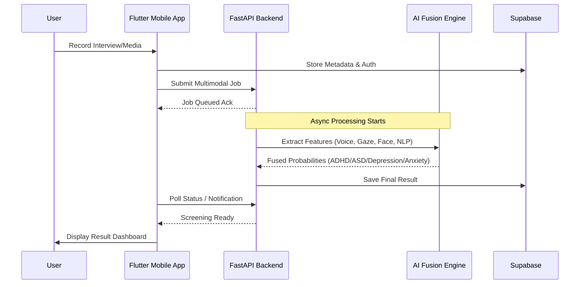
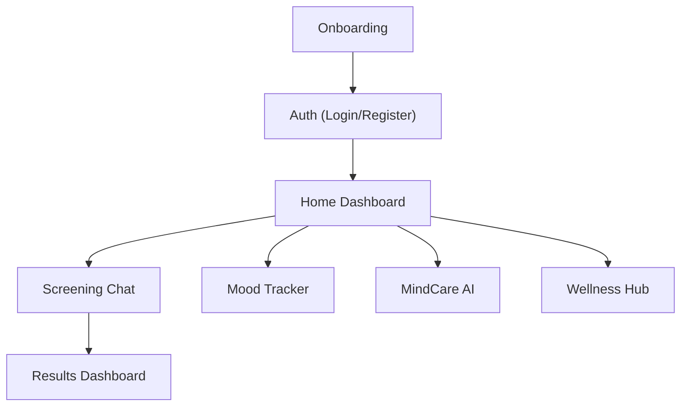

# 🧠 Mindful: AI Mental Health Companion


[](https://flutter.dev)
[](https://fastapi.tiangolo.com)
[](https://www.python.org)
[](https://www.tensorflow.org)
[](https://supabase.com)
[](https://opensource.org/licenses/MIT)

**Mindful** is a cutting-edge, multimodal AI-driven system designed for early screening, monitoring, and support of four key mental health conditions: **ADHD**, **Autism Spectrum Disorder (ASD)**, **Depression**, and **Social Anxiety**. 

By leveraging Computer Vision, Voice Stress Analysis, and NLP, Mindful provides objective biomarkers to supplement traditional clinical assessments.

---

## 🚀 Key Features

<<<<<<< HEAD
*   **⚡ Real-time Multimodal Screening**: Fusion of behavioral data, eye gaze heuristics, and voice prosody for accurate detection of **ADHD**, **ASD**, **Depression**, and **Social Anxiety**. Leverages a comprehensive DAIC-WOZ trained pipeline for video-based and audio depression interviews.
*   **🤖 MindCare AI Companion**: High-empathy supportive chatbot powered by **Gemini 2.0 Flash** for general mental health support, emotional navigation, and triage. Features condition-specific system prompts and persistent session history.
*   **🧘 Wellness Hub & Clinical Resources**: In-app audio streaming of clinically-validated meditations (MBSR/MBCT) compliant with WHO/NICE guidelines, complete with fluid `audio_waveforms` playback and rich resource libraries.
*   **📊 Interactive Mood Monitoring**: Daily mood logging with Glassmorphism-styled metrics, trend analysis, and detailed weekly overviews.
*   **🎙️ Voice & Gaze Analysis**: MFCC-based emotion/impulsivity detection from audio and heuristic-based eye movement tracking for behavioral biomarker extraction.
*   **📱 Premium Liquid Design**: Elegant mobile experience with intuitive screen flows, custom glass containers, and seamless transitions using Flutter.
=======
*   **⚡ Real-time Multimodal Screening**: Fusion of behavioral data, eye gaze heuristics, and voice prosody for accurate detection of **ADHD**, **ASD**, **Depression**, and **Social Anxiety**.
*   **🤖 MindCare AI Companion**: High-empathy supportive chatbot powered by **Gemini 2.0 Flash** for general mental health support, emotional navigation, and grounding.
*   **🧘 Wellness & Meditation Hub**: In-app audio streaming of clinically-validated meditations (MBSR/MBCT protocols) with external continuity for Spotify and YouTube.
*   **📊 Interactive Mood Monitoring**: Daily mood logging with Glassmorphism-styled metrics, trend analysis, and detailed weekly overviews.
*   **🎙️ Voice Stress Analysis**: MFCC-based emotion and impulsivity detection from audio recordings.
*   **👁️ Gaze & Facial Tracking**: Heuristic-based eye movement analysis for behavioral biomarker extraction and facial emotion recognition (AQ-10 integration).
*   **📱 Liquid Glass Design**: Premium mobile experience with smooth iOS-style transitions leveraging modern Flutter components.
>>>>>>> ff182c9fdac30379da638d9ac6fea7dfb94ed4ad

---

## 🏗️ System Architecture

Mindful utilizes a modern client-server architecture built for heavy, asynchronous AI processing without compromising mobile UX.

### High-Level Data Flow



### AI Fusion Engine — Internal Architecture

<<<<<<< HEAD
=======
Mindful employs a multimodal late-fusion strategy to combine signals from different behavioral domains.

>>>>>>> ff182c9fdac30379da638d9ac6fea7dfb94ed4ad
```mermaid
graph TD
    subgraph Input Modalities
        Face[Video/Face Feed]
        Voice[Audio Recording]
        Gaze[Eye Movement]
        Text[Questionnaire / Text]
    end

<<<<<<< HEAD
    subgraph Feature Extraction & Modeling
        Face --> ResNet["ResNet50 (Facial Emotion)"]
        Voice --> MFCC["MFCC / CNN (Voice Stress)"]
        Gaze --> MP["MediaPipe / RF (Eye Gaze)"]
        Text --> CatBoost["CatBoost (Behavioral NLP)"]
    end
    
    ResNet --> FV1[Feature Vector]
    MFCC --> FV2[Feature Vector]
    MP --> FV3[Feature Vector]
    CatBoost --> FV4[Feature Vector]
    
    subgraph Late Fusion
        FV1 & FV2 & FV3 & FV4 --> WPA[Weighted Probability Aggregator]
    end
    
    WPA --> Result["Final Screening Result<br/>(ADHD / ASD / Depression / Social Anxiety)"]
```

=======
    subgraph ADHD & ASD Feature Modeling
        Face --> ResNet["ResNet50 (Facial Emotion)"]
        Voice --> CNN["CNN (Voice Stress)"]
        Gaze --> EyeGaze["MediaPipe (Eye Gaze)"]
        Text --> CatBoost["CatBoost (Behavioral NLP)"]
    end

    subgraph Depression (DAIC-WOZ) Modeling
        Text --> DistilBERT["DistilBERT (NLP)"]
        Voice --> LIGHTGBM["LightGBM (COVAREP Acoustics)"]
        Face --> BILSTM["BiLSTM + Attention (Action Units)"]
    end
    
    ResNet & CNN & EyeGaze & CatBoost --> ADHD_FUSION[Weighted Prob Aggregator]
    DistilBERT & LIGHTGBM & BILSTM --> DEP_FUSION[Logistic Regression Meta-Learner]
    
    ADHD_FUSION --> Result1["ADHD / ASD Result"]
    DEP_FUSION --> Result2["Depression Screening Result"]
```

### 💽 Development Environment (macOS Fix)
> [!IMPORTANT]
> Since standard external drives (ExFAT) do not support the symlinks required by Flutter/Dart, this project is optimized to run inside an **APFS Sparse Disk Image** located at `/Volumes/Mindful_Dev`. If building from source, ensure the project is mounted to a symlink-compatible filesystem.

>>>>>>> ff182c9fdac30379da638d9ac6fea7dfb94ed4ad
### App Screen Flow



---

## 🛠️ Technology Stack

| Layer | Technologies |
| :--- | :--- |
| **Frontend** | Flutter, Riverpod, Supabase Auth, Camera, `just_audio`, `flutter_animate` |
| **Backend** | FastAPI (Async), Uvicorn, BackgroundTasks |
| **AI / NLP** | Google Gemini 2.0 Flash (Companion), TensorFlow, Scikit-learn, MediaPipe, Librosa, OpenCV |
| **Storage** | Supabase (User Data & Results), Cloud Storage (Media Artifacts) |

---

## 🏁 Setup Instructions

### 1. Backend Setup (FastAPI + AI Models)

The backend handles heavy ML workloads natively.

1. Navigate to the `backend/` directory:
   ```bash
   cd backend
   ```
2. Create and activate a Virtual Environment:
   ```bash
   python -m venv .venv
   source .venv/bin/activate  # On Windows: .venv\Scripts\activate
   ```
3. Install dependencies:
   ```bash
   pip install -r requirements.txt
   ```
4. Set up environment variables (see `.env` Configuration below).
5. Start the server:
   ```bash
   python main.py
   ```
   *The Swagger UI will be available at `http://localhost:8000/docs`.*

### 2. Frontend Setup (Flutter App)

1. Navigate to the `frontend/` directory:
   ```bash
   cd frontend
   ```
2. Fetch dependencies:
   ```bash
   flutter pub get
   ```
3. Update Backend Address:
   Open `lib/core/config/api_config.dart` and point `baseUrl` to your local machine running the FastAPI backend via network IP (e.g., `http://192.168.1.X:8000`).
4. Run the application:
   ```bash
   flutter run
   ```

---

## 🔑 Environment Configuration (`.env`)

Inside the `backend/` directory, create a `.env` file mapping exactly to `.env.example`:

```env
# Google Gemini API Key for MindCare AI Companion
GEMINI_API_KEY=your_gemini_api_key_here

# Supabase Configuration for Authentication and Database
SUPABASE_URL=https://your-project.supabase.co
SUPABASE_ANON_KEY=your_supabase_anon_key_here
```

*Note: Ensure `.env` is strongly guarded and never pushed to source control (it is excluded by `.gitignore`).*

---

## 📜 License & Academic Citation

### License
This project is open-source under the **MIT License**. See the [LICENSE](LICENSE) file for more information.

### Academic Disclaimer
> **Warning**: Mindful is an **Academic Research Prototype**. It is designed for study and exploration into multimodal objective biomarkers. It is **not** a certified medical diagnostic tool or substitute for professional medical advice.

### Citation
If you utilize this codebase or framework for your academic research, please consider citing this repository:

```bibtex
@software{Mindful_AI_Mental_Health,
  author = {Ali, Mohamed and [Contributors]},
  title = {Mindful: Multimodal AI Mental Health Companion},
  year = {2024},
  url = {https://github.com/A7med580/AI-mental-Health}
}
```
