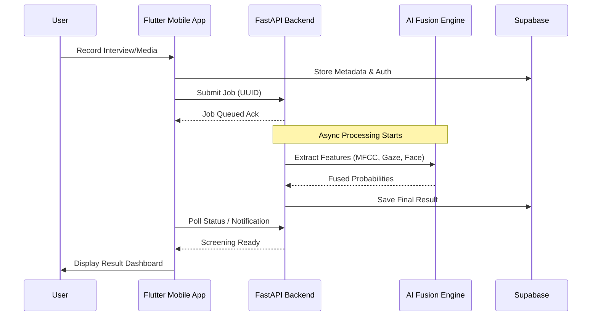
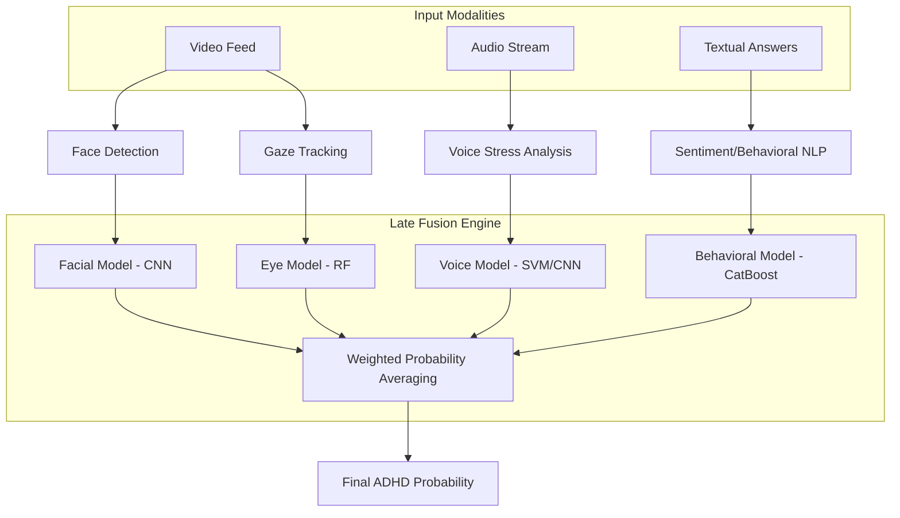

# 🧠 Mindful: AI Mental Health Companion

[](https://flutter.dev)
[](https://fastapi.tiangolo.com)
[](https://www.python.org)
[](https://www.tensorflow.org)
[](https://supabase.com)

**Mindful** is a cutting-edge, multimodal AI-driven system designed for early screening of mental health conditions like **ADHD** and **Autism (ASD)**. By leveraging Computer Vision, Voice Stress Analysis, and NLP, Mindful provides objective biomarkers to supplement traditional clinical assessments.

---

## 🚀 Key Features

*   **⚡ Real-time ADHD Screening**: Multi-modal fusion of behavioral data, eye gaze heuristics, and voice prosody.
*   **🧩 ASD Detection**: Advanced facial emotion recognition coupled with standardized AQ-10 diagnostics.
*   **🎙️ Voice Stress Analysis**: MFCC-based emotion and impulsivity detection from audio recordings.
*   **👁️ Gaze Tracking**: Heuristic-based eye movement analysis for behavioral biomarker extraction.
*   **🔔 Smart Notifications**: Asynchronous background processing with in-app result alerts.

---

## 🏗️ System Architecture

Mindful follows a modern client-server architecture designed for heavy AI processing without compromising mobile user experience.

### High-Level Data Flow



### AI Fusion Strategy (ADHD)



---

## 🛠️ Technology Stack

| Layer | Technologies |
| :--- | :--- |
| **Frontend** | Flutter, Riverpod, Supabase Auth, Camera/Video Player |
| **Backend** | FastAPI (Async), Uvicorn, BackgroundTasks |
| **AI/ML** | TensorFlow/Keras, Scikit-learn, MediaPipe, Librosa, OpenCV |
| **Storage** | Supabase (User Data), Local Persistent OS Storage (Media) |

---

## 📂 Project Structure

```text
.
├── backend/                # FastAPI Python Server
│   ├── Models/             # Serialized AI Models (.h5, .pkl)
│   ├── services/           # AI Logic & Feature Extractors
│   │   ├── model_router.py # Request routing
│   │   └── adhd_fusion.py  # Multi-modal fusion logic
│   └── main.py             # Server Entry Point
├── frontend/               # Flutter Mobile Application
│   ├── lib/
│   │   ├── core/           # Config, Themes, and Constants
│   │   ├── screens/        # UI Implementation
│   │   └── services/       # API, Jobs, and Notification services
│   └── pubspec.yaml        # Flutter Dependencies
└── README.md
```

---

## 🏁 Getting Started

### Backend Setup
1. Navigate to `/backend`
2. Install dependencies: `pip install -r requirements.txt`
3. Start the server: `python main.py`

### Frontend Setup
1. Navigate to `/frontend`
2. Update `lib/core/config/api_config.dart` with your local IP.
3. Run the app: `flutter run`

---

## ⚖️ Disclaimer
This project is a **Research Prototype** for academic purposes (PUA). It is **not** a certified medical diagnostic tool.
